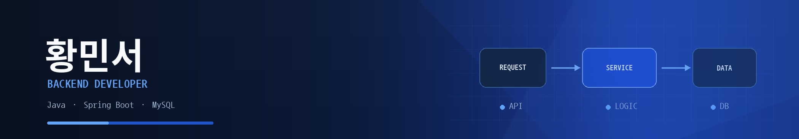

  

 

백엔드 서비스의 데이터 흐름과 상태 관리를 구현하는 개발자 황민서입니다.

**About me**

- **Education** — 인덕대학교 컴퓨터소프트웨어학과
- **Focus** — Java · Spring Boot 기반 예매, 인증, 관리자 기능
- **Engineering** — 요청 처리부터 검증, 저장, 조회, 상태 변경까지 연결
- **Projects** — 웹 백엔드, 보안 네트워크, 데이터 분석 프로젝트
- **Awards** — 2025 교내 경진대회 최우수상 2회 · 금상 2회
- **Portfolio** — [프로젝트 구현 과정과 문제 해결 기록](https://allen8524.github.io/)

<code></code>
<code></code>
<code></code>
<code></code>
<code></code>
<code></code>
<code></code>
<code></code>

 
 

|  |  |
| --- | --- |

#### Top Repositories

 
 

  <a href="https://allen8524.github.io/">Portfolio</a>
  &nbsp;·&nbsp;
  <a href="mailto:minseo8524@gmail.com">Email</a>
  &nbsp;·&nbsp;
  <a href="https://solved.ac/profile/allen8524">Solved.ac</a>

